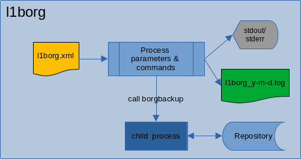

## l1borg

The [1]BorgBackup is an amazing program to backup both local and remote using deduplication techniques. It is very simple to use and its features allow us to create scripts to customize and automate your operation.

<b>l1borg</b> is a utility designed to solve some of my needs for automating the use of BorgBackup. 
The <b>l1borg</b> load the settings for the backup running from the XML file <i>l1borg.xml</i>, and run the BorgBackup with the necessary parameters.

<b>l1borg</b> doesn't handle remote repositories, but only local. 
At thist time, I don't really intend to make it a utility with many functions, and its evolution is linked to my usage needs, but feel free to use it as a starting point for a fork or new ideas.

<b>l1borg</b> was coded entirely in C++. As I consider QtCreator(tm) to be an excellent development environment, I use it for my projects, even if these don't directly involve using the Qt(tm) tools.

### Dependencies for compilation:
gcc/g++ which meets the c++17
Libs: tinyxml2 and Boost

### My environment 
Fedora 33 
gcc (GCC) 10.2.1 20201125 
QtCreator 4.14 (Qt 5.15.2) 
cmake version 3.18.4 
Boost 1.73 
tinyxml2-7.0.1-5 

### Flowchart

### Usage 

__l1borg__ --help 
Valid options are: 
--init-repo   : Initialize all repositories. 
--make-backup : Make backup. 
--cmd         : Execute a BorgBackup command. 
&emsp;&emsp;&emsp;&emsp;Double quotes are mandatory: 
&emsp;&emsp;&emsp;&emsp;e.g.: l1borg --cmd info PATH/REPONAME --prefix=srv1 
(the _--list_, _--info_ and _--diff_ commands are only simplifications of analogous commands in BorgBackup.) 
--info        : all | REPONAME[::FILENAME] 
&emsp;&emsp;&emsp;&emsp;NOTE: Enter only the repository name without the path: e.g: --info R1 | --info R1::archive 
--list        : all | REPONAME[::FILENAME]" 
&emsp;&emsp;&emsp;&emsp;NOTE: Enter only the repository name without the path: e.g: --list R1 | --list R1::archive 
--diff        : REPONAME::ARCHIVE1 ARCHIVE2 
&emsp;&emsp;&emsp;&emsp;NOTE: Enter only the repository name without the path  

__l1borg.xml__ Sample: See docs/l1borg.xml

## References
[1] BorgBackup <https://borgbackup.readthedocs.io/en/stable/index.html> 
Copyright (C) 2015-2020 The Borg Collective
<https://borgbackup.readthedocs.io/en/stable/authors.html> 
Copyright (C) 2010-2014 Jonas Borgström  <jonas@borgstrom.se> All rights reserved. 
